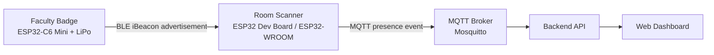
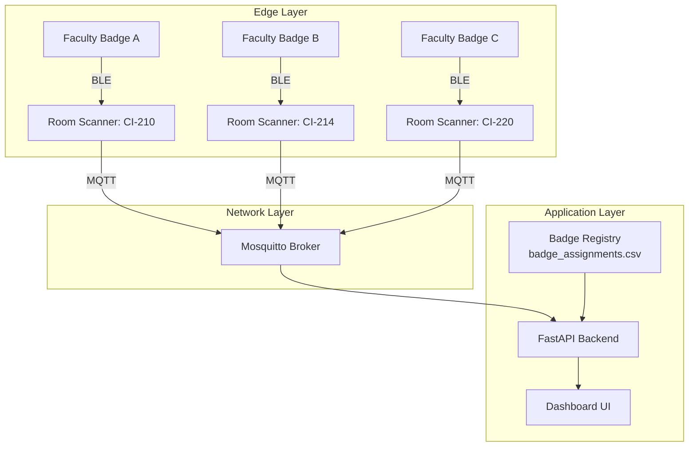
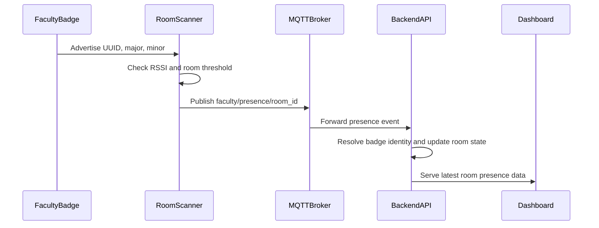
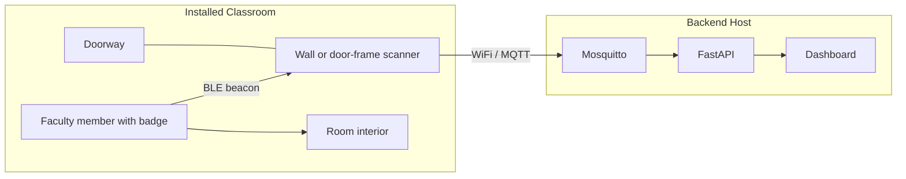
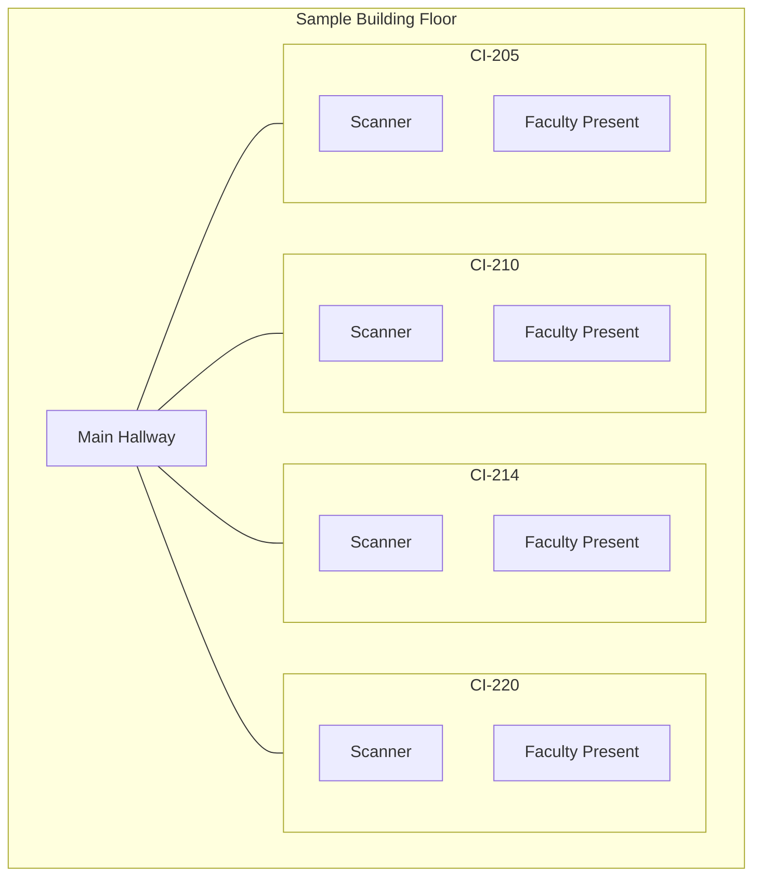

# Faculty Locator

Faculty Locator is a classroom-scale prototype for tracking when instructors are present in a room.

BLE badges broadcast a simple iBeacon-style identifier, room scanners detect those broadcasts, and a lightweight backend publishes the resulting presence data to a web dashboard. The project is designed as a teaching-friendly mock-up that demonstrates the architecture behind room presence systems without the cost or complexity of a full enterprise deployment.

## How It Works



Badges stay simple: they advertise a BLE identity and do not need to know anything about WiFi, MQTT, or the dashboard. Room scanners bridge the wireless badge world to the networked backend by listening for nearby badge broadcasts and publishing presence events. The backend then resolves badge identities, keeps the latest room state in memory, and presents that information through the dashboard.

## System Architecture



## Event Flow



Each event moves through a very small pipeline. A badge advertises, the closest room scanner observes that signal, MQTT moves the event to the backend, and the backend updates the dashboard state. Keeping each stage narrow makes the system easier to debug in class and easier to scale later.

## Installed View



Mounted in practice, each room gets a small scanner near the doorway or just inside the room boundary. Faculty badges do not need a screen or direct network access. A single VM can host the MQTT broker and dashboard for a small deployment or lab demonstration.

## Sample Floor Layout



That layout shows the intended deployment model: one scanner per room, each reporting presence independently. A badge seen at `CI-214` should update only that room unless another scanner later reports the same badge in a different location. In a larger building, the same pattern simply repeats across additional rooms and floors.

## Project Components

- `badge_beacon/`
  Badge firmware for the wearable BLE beacon.
- `room_scanner/`
  ESP32 scanner firmware that detects badges and publishes room presence events over MQTT.
- `backend/`
  FastAPI backend that subscribes to MQTT, resolves badge identities, and serves the dashboard.
- `dashboard/`
  Browser UI for viewing room status and faculty presence.
- `badge_assignments.csv`
  Badge registry used by the backend to map `major` and `minor` values to faculty identities.
- `simulate_badges.py`
  Simulator for testing the backend and dashboard without hardware.
- `vm_setup.sh`
  Ubuntu VM helper script for installing Mosquitto and the dashboard service.
- `LAB_GUIDE.md`
  Full lab handout, hardware notes, and classroom-facing documentation.

## Hardware Model

- Badge hardware: `ESP32-C6 Mini`
- Scanner hardware: `ESP32 Dev Module` or similar USB-powered ESP32 board
- Backend host: Ubuntu VM or another always-on machine running Mosquitto and FastAPI

## Quick Start

### 1. Set up the backend host

Copy this repo to an Ubuntu VM or Linux host and run:

```bash
./vm_setup.sh
```

Use the menu to:

1. install Mosquitto
2. install the dashboard service

After setup, open the dashboard in a browser using the VM's IP address and configured port.

### 2. Flash a badge

- Open `badge_beacon/badge_beacon.ino` in Arduino IDE
- Select the correct board for your badge hardware
- Set `BEACON_MINOR` to a unique badge number
- Flash the firmware

### 3. Flash a room scanner

- Open `room_scanner/room_scanner.ino`
- Set `WIFI_SSID`, `WIFI_PASSWORD`, and `MQTT_BROKER`
- Set the room metadata such as `ROOM_ID` and `ROOM_NAME`
- Flash the scanner to an ESP32 dev board

### 4. Register badges

Add or update badge identities in `badge_assignments.csv`.

The backend uses that file as the source of truth, so adding new badges does not require reflashing the scanner.

### 5. Test end to end

- Bring the badge near the scanner
- Confirm scanner output in the Arduino Serial Monitor
- Open the dashboard and verify the faculty member appears in the correct room

## Local Demo Without Hardware

The simulator can drive the backend with synthetic room events:

```bash
python3 -m venv .venv
source .venv/bin/activate
python3 -m pip install -r backend/requirements.txt
python3 simulate_badges.py --broker YOUR_BROKER_IP
```

That path is useful for validating the dashboard and MQTT flow before scanners and badges are fully deployed.

## Deployment Notes

- The scanner should publish to the backend host's LAN IP, not `localhost`
- The backend can use `localhost:1883` when Mosquitto runs on the same machine
- The included Mosquitto config is intentionally simple for lab use and should not be treated as production-hardened

## Documentation

- Backend details: `backend/README.md`
- Lab guide: `LAB_GUIDE.md`

## Purpose

Faculty Locator is meant to be understandable, testable, and easy to extend in a classroom setting. The project is a good fit for courses covering IoT, cybersecurity, wireless systems, embedded development, or systems integration.
